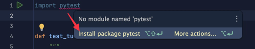

<h1>TESTING</h1>

[//]: # (#### EXERCISE #########################################################)

## 🧑‍💻 Generate Tests

Please...

1. Generate tests for the code in `turtlewalk/walker.py`. Make sure your tests...

- Are comprehensive
- Cover edge cases
- Include a docstring
- Test one "thing" per test
- Are independent

2. Include the tests created in the script, `turtlewalk/test_walker.py`

3. Installed Pytest. You can do this via (A) the 'Python Packages' tool
   pane, (B) 'Settings > Project:
   YOUR_PROJECT_NAME > Python Interpreter', or also (C) via the popup that
   should appear on the import command for Pytest:  
   

3. Run the tests via right-click menu of the main script.

4. Create a run configuration, run it, and set it to auto-run every time you change a line of code.

<h1>APPENDIX</h1>

[Notebook Style]

